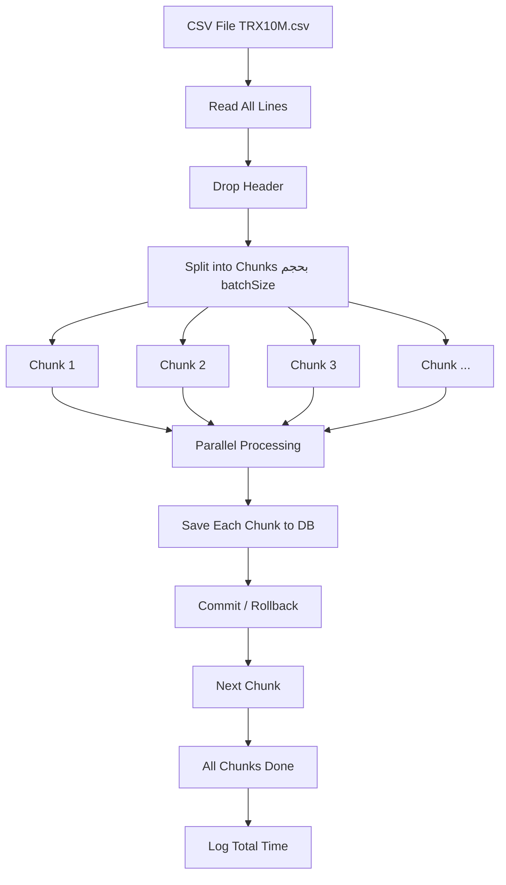

# Functional Discount Pipeline (Scala)

A scalable, functional discount engine for processing large-scale retail transactions.  
The system applies multiple business rules, computes final prices, and persists results into a relational database using a batch-based pipeline.

---

## Overview

The system processes CSV transaction data through an end-to-end pipeline:

- Reads and parses raw CSV input
- Converts data into strongly typed domain models (`Order`)
- Applies a functional rule engine to compute discounts
- Aggregates multiple rule outputs into a final discount
- Calculates final transaction price
- Persists processed results into a database
- Logs execution flow and errors for monitoring

The architecture separates **business logic (pure functions)** from **side-effect operations (I/O handling)**.

---

## Configuration

The project uses an external configuration file for environment settings.

- Database connection details are stored in a config file ( `application.conf`)
- Config is loaded at runtime using Typesafe Config
- No hardcoded credentials inside the codebase


---

## System Design

The system is divided into two main concerns:

### Core Logic Layer
Responsible for business rules and transformations:

- Discount rule evaluation
- Immutable data processing
- Pure functions with deterministic outputs

### Side-Effect Layer
Responsible for external interactions:

- CSV file reading
- Database communication (JDBC)
- Logging system
- Configuration loading
- Pipeline orchestration and batching

---

## Processing Model

- Input data is processed in fixed-size batches  
- Each batch is handled independently  
- Parallel execution is applied per batch  
- Memory usage remains constant regardless of dataset size  

This ensures the system can handle large-scale inputs efficiently.

---

## Project Structure

```text
engine/
│
├── Main.scala            → Pipeline orchestration and execution flow
├── Rules.scala           → Functional discount engine (core logic)
├── DB.scala              → Database batch insert operations
├── DB_connection.scala   → JDBC connection using external config
├── AppLogger.scala       → Logging configuration
├── utils.scala           → Parsing and helper utilities
└── models                → Domain models (Order, ProcessedOrder)
```


---

## Execution Flow

1. Load configuration file  
2. Initialize database connection  
3. Read CSV file from disk  
4. Split data into batches  
5. Parse each row into `Order` objects  
6. Apply discount rule engine  
7. Compute final price per order  
8. Store results in database  
9. Log execution status  



---

## Logging

Two log files are used:

| File         | Purpose                 |
|--------------|-------------------------|
| pipeline.log | Normal execution flow   |
| errors.log   | Failures and exceptions |

### Log Format
TIMESTAMP LEVEL MESSAGE


Logs capture:
- Pipeline lifecycle events  
- Batch processing status  
- Database operations  
- Runtime errors  

